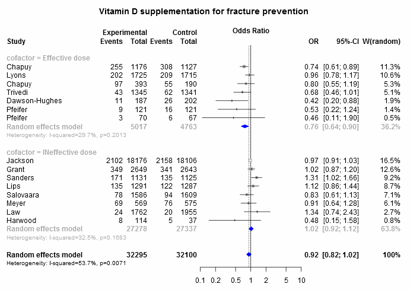
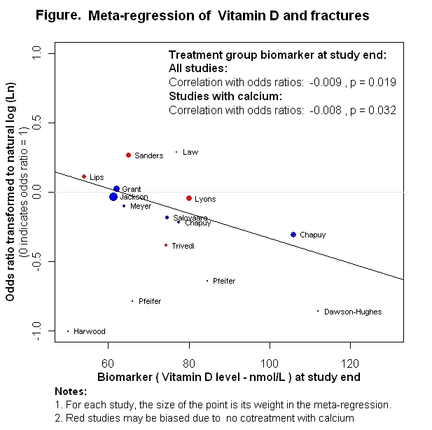

Osteoporotic fracture prevention with vitamin D
=================================
A data-only living systematic review

**Clinical summary:** This meta-analysis suggests that vitamin D supplementation is associated with a reduction in fractures when given in effective doses (see Figure). Effective is defined as a dose that raises the serum level of vitamin D by 20 nmol/L (8 ng/mL) and achieves a final level of at least 60 nmol/L (24 ng/mL). Heterogeneity of results as measured by I2 in this subgroup '[might not be important](http://handbook-5-1.cochrane.org/chapter_9/9_5_2_identifying_and_measuring_heterogeneity.htm)' at 30%. This review updates a  previously published meta-analysis.

* [Reconciliation of conclusions with prior meta-analyses](files/reconciliation-tables/Reconciliation%20of%20conclusions.pdf) (under construction)
* [Keep current with this topic](files/searching/Keep-up.md) (not available)

**Methods overview:** This repository is an [openMetaAnalysis](https://openmetaanalysis.github.io/) that combines methods of scoping, rapid, and living systematic reviews.  This analysis updates one or more previously published review(s).(1) A comparison of studies include in this review compared to prior reviews are in the table, [reconciliation of trials included with prior meta-analyses/](files/reconciliation-tables/Reconciliation%20of%20studies.pdf). Newer studies included are listed in the references below. Rationale for newer trials excluded may be listed at the end of the references. 
* [Methods](http://openmetaanalysis.github.io/methods.html) for openMetaAnalysis
* [Evidence search](files/searching/evidence-search.md) for this review

See [methods](http://openmetaanalysis.github.io/methods.html) for details.

**Results:** Details of the studies included are in the:
* [Reconciliation of trials included with prior meta-analyses/](files/reconciliation-tables/Reconciliation%20of%20studies.pdf) (under construction)
* [Description of studies (PICO table)](files/study-details/table-pico.pdf) (under construction)
* [Risk of bias assessment](files/study-details/table-bias.pdf) (under construction)
* [Forest plots](../master/files/forest-plots) ([source data](files/data))
* [Network plots](../master/files/network) (optional)

The forest plot for the primary outcomes are below. Additional [forest plots](files/forest-plots) of secondary analyses may be available. 

The meta-regression for the primary outcomes are below. Additional [meta-regressions](files/metaregression) of secondary analyses may be available. 

References:
----------------------------------

### Systematic review(s)
#### Most recent review at time of last revision of this repository
1. Zhao JG, Zeng XT, Wang J, Liu L. Association Between Calcium or Vitamin D Supplementation and Fracture Incidence in Community-Dwelling Older Adults: A Systematic Review and Meta-analysis. JAMA. 2017 Dec 26;318(24):2466-2482. doi:
[0.1001/jama.2017.19344](http://dx.doi.org/0.1001/jama.2017.19344). PMID: [29279934](http://pubmed.gov/29279934)
2. Reid IR, Bolland MJ, Grey A. Effects of vitamin D supplements on bone mineral density: a systematic review and meta-analysis. Lancet. 2014 Jan 11;383(9912):146-55. doi: [10.1016/S0140-6736(13)61647-5](http://dx.doi.org/10.1016/S0140-6736(13)61647-5). PMID: [24119980](http://pubmed.gov/24119980).
3. Avenell A, Mak JC, O'Connell D. Vitamin D and vitamin D analogues for preventing fractures in post-menopausal women and older men. Cochrane Database Syst Rev. 2014 Apr 14;(4):CD000227. doi: [10.1002/14651858.CD000227.pub4](http://dx.doi.org/10.1002/14651858.CD000227.pub4). PMID: [24729336](http://pubmed.gov/24729336)
4. Bischoff-Ferrari HA, Willett WC, Orav EJ, Lips P, Meunier PJ, Lyons RA et al. A pooled analysis of vitamin D dose
requirements for fracture prevention. N Engl J Med. 2012 Jul 5;367(1):40-9. doi: [10.1056/NEJMoa1109617](http://dx.doi.org/10.1056/NEJMoa1109617). PMID: [22762317](http://pubmed.gov/22762317).
5. Chung M, Lee J, Terasawa T, Lau J, Trikalinos TA. Vitamin D with or without calcium supplementation for prevention of cancer and fractures: an updated meta-analysis for the U.S. Preventive Services Task Force. Ann Intern Med. 2011 Dec 20;155(12):827-38. doi: [10.7326/0003-4819-155-12-201112200-00005](http://dx.doi.org/10.7326/0003-4819-155-12-201112200-00005). PMID: [22184690](http://pubmed.gov/22184690).

### Randomized controlled trials
#### New trial(s) *not* included in the most recent review above
1. Neelemaat F, Lips P, Bosmans JE, Thijs A, Seidell JC, van Bokhorst-de van der Schueren MA. Short-term oral nutritional intervention with protein and vitamin D decreases falls in malnourished older adults. J Am Geriatr Soc. 2012 Apr;60(4):691-9. doi: [10.1111/j.1532-5415.2011.03888.x](http://dx.doi.org/10.1111/j.1532-5415.2011.03888.x). PMID: [22316322](http://pubmed.gov/22316322).

#### Trial(s) undergoing review
None

#### Trial(s) excluded - selected list of important trial(s)

#### Cited by
This repository is cited by:

1. WikiDoc contributors. Pending content page. WikiDoc. Nov 9, 2014. Available at: http://www.wikidoc.org/index.php/This_topic. Accessed November 9, 2014. 

-------------------------------
[Cite and use this content](https://github.com/openMetaAnalysis/openMetaAnalysis.github.io/blob/master/reusing.MD)  - [Edit this page](../../edit/master/README.md) - [History](../../commits/master/README.md)  - 
[Issues and comments](../../issues?q=is%3Aboth+is%3Aissue)

